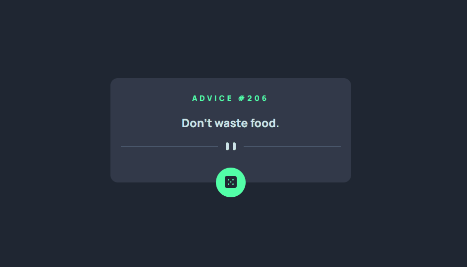

# Advice Generator app

Desafio do site [Frontend Mentor | Advice Generator app](https://www.frontendmentor.io/challenges/advice-generator-app-QdUG-13db) que consiste em criar um app que interage com a API [Advice Slip API](https://api.adviceslip.com/) para gerar conselhos aleatórios.

## Tabela de Conteúdo

- [Desafio](#desafio)
- [Screenshot](#screenshot)
- [Ferramentas](#ferramentas)
- [Autora](#autora)

## Desafio

Um dos desafios desse projeto foi estilizar a página conforme os designs do site Frontend Mentor e tornar o site responsivo com a propriedade do flexbox do CSS.  
Porém, a principal habilidade treinada foi pegar os dados da API e atualizar os conteúdos no HTML. 

## Screenshot

## Ferramentas

- HTML com semântica
- Estilização com CSS
- JavaScript (DOM, funções, fetch, json)
- [API geradora de conselhos aleatórios](https://api.adviceslip.com/)

## Autora

- LinkedIn - [Camila Katayama](https://www.linkedin.com/in/camila-katayama-ab1a42153/)
- GitHub - [@camilakataa](https://github.com/camilakataa)

